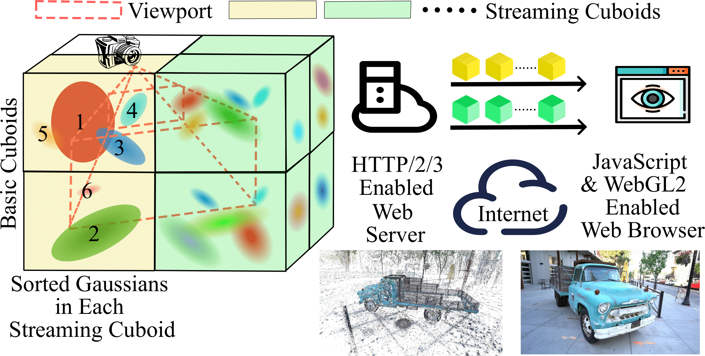

# [SGSS: Streaming 6-DoF Navigation of Gaussian Splat Scenes](https://dl.acm.org/doi/abs/10.1145/3712676.3714437)

3D Gaussian Splatting (3DGS) is an emerging approach for training and representing real-world 3D scenes. Due to its photorealistic novel view synthesis and fast rendering speed (e.g., over 100 FPS), it has the potential to transform how scenes that can be explored in 6 degrees-of-freedom (6-DoF) are represented. However, a limiting factor of 3DGS is its large size, e.g., over 1 GBytes for one static scene. This inhibits its use for streaming of reconstructed real-world 3D scenes, due to the high network bandwidth requirement.

In this paper, we propose a streaming approach, SGSS, for optimizing the streaming transmission of 3DGS during 6-DoF navigation of the scene. Given that not all Gaussians in the full scene are needed for rendering a user's view, SGSS uses view-adaptive transmission, enabled by optimized spatial partitioning of the scene into cuboids, for achieving network transmission savings. For each spatially-partitioned cuboid,  SGSS uses an importance-based Gaussians pre-sorting scheme to enhance the initial view quality and reduce the user-perceived scene loading time. We further design a client-side viewport-adaptive streaming algorithm that features lightweight visibility checking, prioritized cuboid streaming, incremental cuboid processing, and stream pausing and resuming schemes. We implement SGSS with Javascript and WebGL2. Extensive evaluation results show that the PSNR results of views rendered with SGSS streaming are consistently higher or on par with state-of-the-art approaches. Furthermore, the view-adaptive transmission of SGSS can result in high savings in network transmission on average without impacting the PSNR of views. 

<p align="center">

</p>

## Environment Requirements
### Python 
Please follow [3D Gaussian Splatting for Real-Time Radiance Field Rendering](https://github.com/graphdeco-inria/gaussian-splatting) for environment requirements.

### Server 
We use [H2O](https://h2o.examp1e.net/) as our server. Follow the instructions and set up your own server. You can install it from the [installation page](https://h2o.examp1e.net/install.html).

### Gurobi
Make sure you have Gurobi correctly installed in your work path with a valid [Gurobi License](https://www.gurobi.com/solutions/licensing/).

## 3DGS scenes
We use 12 pre-trained 3DGS scenes from the original 3DGS. You can download the pre-trained models from [Pre-trained Models (14 GB)](https://repo-sam.inria.fr/fungraph/3d-gaussian-splatting/datasets/pretrained/models.zip). The pre-trained files will be stored in `scene/point_cloud/iteration_30000/point_cloud.ply`.

## Optimal Spatial Partitioning 
### Basic Spatial Partitioning 
Before generating streaming cuboids, we need to get basic cuboids first. Run [pre_processing/voxel_gaussian.py](./pre_processing/voxel_gaussian.py)
```
python voxel_gaussian.py --ply_file_path path/to/3dgs_scene.ply --output_folder path/to/all_basic_cuboids --scene_name scene
```

### Optimization
To generate matrix A and $$C_{num}$$ and $$C_{num'}$$ mentioned in the paper Section 3.2, which will be used in ILP, run [pre_processing/build_matrix_A.py](./pre_processing/build_matrix_A.py)
```
python build_matrix_A.py --ply_file_path path/to/3dgs_scene.ply --output_folder path/to/matrices --scene_name scene
```
This will generate `matrix_A.npy`, `C_cost.npy` and `C_store_0and1.npy` in the output folder.

Next, we need to generate $$R_{waste}$$. Run [pre_processing/projection_model.py](./pre_processing/projection_model.py). The input will be the files generated before and original 3D Gaussian Splat scenes ending with .ply. The `camera.json` file is in the folder where you saved the trained 3D Gaussian Splat scenes. This is generated by original 3DGS code.
```commandline
python projection_model.py \
    --ply_file_path /path/to/point_cloud.ply \
    --cameras_path /path/to/cameras.json \
    --matrix_a_path /path/to/matrix_A.npy \
    --c_store_path /path/to/C_cost.npy \
    --voxel_path /path/to/voxel_new.json \
    --output_folder /path/to/Cd_new.npy \
    --scene_name scene_name
```
---
Available scenes: `bicycle`, `bonsai`, `drjohnson`, `flowers`, `garden`, `kitchen`, `playroom`, `room`, `stump`, `train`, `treehill`, `truck`

---

Once got matrix_A (matrix_A.npy), $$R_{waste}$$ (Cd_new.npy) and $$C_{num'}$$ (C_store_0an1.npy), we can use them in ILP to get the optimized solution form ILP.

#### Prerequisites
Before running the script, ensure you have the following files in your scene directory:
- `Cd_new.npy`
- `C_store_0and1.npy`
- `matrix_A.npy`

#### Scene Setup
1. Create a directory with your scene name
2. Place the required `.npy` files in the scene directory
3. Calculate your scene's `directory_divisor`:
   - Count the number of 1's in `C_store_0and1.npy`
   - Set this value in the script

#### Usage
Run the script in your Python environment:
```bash
  python run_gurobi_flow.py
```

#### Output
The script will generate `x_solution.npy` in your scene directory, containing the optimization result for further use.

After receiving `x_solution.npy` from ILP, run [pre_processing/optimal_voxelization.py](./pre_processing/optimal_voxelization.py) to generate the streaming cuboids.
```commandline
python optimal_voxelization.py \
    --matrix_a_path /path/to/matrix_A.npy \
    --c_cost_path /path/to/C_cost.npy \
    --ply_file_path /path/to/point_cloud.ply \
    --x_solution_path /path/to/x_solution.npy \
    --output_folder /path/to/output_folder \
    --scene_name scene_name
```
## Before Streaming
Before streaming, we need to generate streamable files. In our experiment, we only diffuse color of 3DGS (SH=0). If you want to generate 3DGS with SH < 2 or SH < 3 only, you can change the input. Run [pre_processing/streaming_cuboids.py](./pre_processing/streaming_cuboids.py).
```commandline
python streaming_cuboids.py [OPTIONS]
```

| Argument          | Type   | Required                          | Default    | Description                                          |
|-------------------|--------|-----------------------------------|------------|------------------------------------------------------|
| `--ply_file_path` | str    | Required if `mode='full'`         | None       | Path to the PLY file.                                |
| `--method`        | str    | Yes                               | None       | Method to process the PLY file:`anti`,`wo`,`wois`,`sgss`|
| `--output_folder` | str    | Yes                               | None       | Output folder for results.                           |
| `--scene_name`    | str    | Required if `mode='full'`         | None       | Scene name for the output.                           |
| `--sh_degree`     | int    | No                                | `0`        | SH degree (default: 0).                              |
| `--mode`          | str    | Yes                               | `'full'`   | Mode of operation: `'full'` or `'voxel'`.            |
| `--input_folder`  | str    | Required if `mode='voxel'`        | None       | Input folder for voxel mode.                         |
| `--json_file`     | str    | Required if `mode='voxel'`        | None       | Path to the JSON file for voxel metadata.            |

## Streaming with web_viewer
Please put all the streamable files in the folder of h2o/examples/doc_root/assests/data/. The structure should be
```plaintext
h2o/
└── examples/
    └── doc_root/
        ├── [JavaScript files]
        ├── index.html
        ├── assets/
            └── data/
                └── [scene_name folders]/
                    ├── limit_camera_trace.json (Generated from experiment)
                    ├── smooth_camera_trace.json (Generated from experiment)
                    ├── [Other streamable files]
                    └── optimal_voxels/
                        ├── 1.ply
                        ├── ...
                        ├── voxel_id.ply
                        └── voxel_new.json
```
| File Name           | Description                                         |
|---------------------|-----------------------------------------------------|
| `anti.js`           | [3D Gaussian Splat Viewer](https://github.com/antimatter15/splat) |
| `full_down.js`      | Fully download                                      |
| `wo.js`             | Pre-sorting based on distance                       |
| `vivo.js`           | ViVo                                                |
| `nosp.js`           | Our method without Optimal Spatial Partitioning     |
| `http2_color.js`    | Our method without Importance Sorting               |
| `http2_priority.js` | Our method                                          |

Then start the H2O server.
```commandline
/usr/local/bin/h2o -c path/to/h2o/examples/h2o/h2o.conf
```

Choose a method that you want to try (see table above). Then change `line  239 <script src="wo.js"></script>` to the corresponding JavaScript file in [index.html](./index.html).
Go to the JavaScript file, if you choose 'anti', 'full_down' or 'wo', please change variables in `line 618 & 619 & 625` to your path. Otherwise, make sure you change twos variable `scene_name` and `root` in function `url_worker()`, and variables `cam_url`, `voxel_url` and `scene_name` in the `main` function to your own server and folder settings. Then, go to
```commandline
https://localhost:port/index.html
```
You should be able to see the scene.

Our source code is derived from [3D Gaussian Splat Viewer](https://github.com/antimatter15/splat) developed by antimatter15. Thanks to the author!
## Experiment
To generate the orbital shot trace and dolly shot trace in our experiment, run [experiment/cam_trace.py](./experiment/cam_trace.py).
```commandline
python cam_trace.py --scene_name scene_name --input_camera_path path/to/cameras.json --output_folder output_folder --mode full/limit
```
The `camera.json` is the same file to one in Optimization. If you choose mode `full`, the output file will `smooth_camera_trace.json`(orbital shot). Otherwise, the output file will be `limit_camera_trace.json` (dolly shot).  

To run bash script for automatic experiment, please follow the [experiment/bash_example.sh](./experiment/bash_example.sh). Before running, activate the rendering function in JavaScript code. 
```
if(camera.is_key_frame){
   saveCanvasAsPNG(canvas, scene_name+'_our_200_' + camera.img_name)
}
```

## Sample folder
You can download the sample folder of h2o [here](https://rutgers.box.com/s/6qcq3f0nui2zhd82kfg32k75ztqp9naf). This folder contains the h2o server config and streamable files of `bonsai`. You can start the server and try the web viewer.The basic partitioning files are in the `voxel_new` folder, and the optimized partitioning files are in the `voxel_ilp` folder.


You can also access the step results of `bonsai` [here](https://drive.google.com/file/d/14IJRYtdAlCQeiOGlssuPkP5M-xcoj9VV/view?usp=sharing). This folder contains the output from each step. 
## Bibtex
Please reference the following publication when using this repository. 
```
@inproceedings{zhu2025sgss,
  title={SGSS: Streaming 6-DoF Navigation of Gaussian Splat Scenes},
  author={Zhu, Mufeng and Liu, Mingju and Yu, Cunxi and Hsu, Cheng-Hsin and Liu, Yao},
  booktitle={Proceedings of the 16th ACM Multimedia Systems Conference},
  pages={46--56},
  year={2025}
}
```

